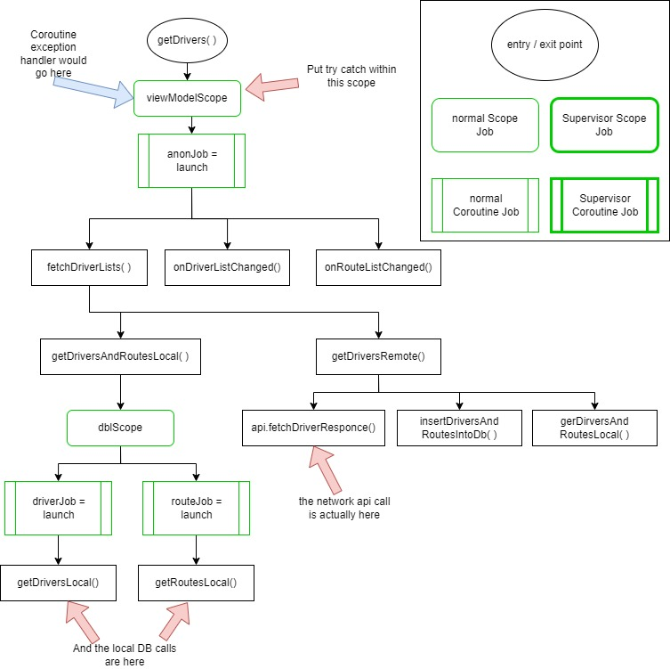

# AndroidArchitectureExample3

# Introduction
This project is an example of State of the Art Android Architecture circa 2023. It uses:
* Kotlin 100%
* Koin for Dependency Injection
  * For now, the only classes that are injected are the ViewModel and Repository
* Compose for building UI
  * Also uses Compose NavGraph navigation
* MVI Architecture using ViewModel to:
  * persist UI local cache across orientation changes
  * UI state variables governing UI compose
  * User Events (The I in MVI "intents") to trigger actions in response to user triggers
    * These actions are the business logic which in turn calculate values for UI display
    * Some actions perform calculations local to the ViewModel
    * Other actions require a data source
      * The data source is the Repository
* Repository to separate business logic from Data Source
  * Examples of both localDataSource and remoteDataSource
  * localDataSource is ROOM DB
  * remoteDataSource is RetroFit2
* Use Flows to move data back to UI compose (via the ViewModel) from Repository
* Coroutines for both serial and parallel structured concurrency
* Automated Testing
  * ViewModel unit tests
  * Repository integration tests
  * UI Compose smoke tests

# Requirements
Build a sample app using State of the Art Architectural components.

*Functional Requirements*

Rest API endpoint:
https://d49c3a78-a4f2-437d-bf72-569334dea17c.mock.pstmn.io/data

The endpoint returns two lists: Drivers and Routes
Create a local persistent data source of the remote data that can serve as a cache.

Two Screens: Driver and Route

Driver Screen:
* Displays list of driver names and ids
* FAB sort button. Sort based on last name
* When a particular driver is selected, Route Screen is displayed for that driver

Route Screen
* List of routes for a given driver depends on business rules. 
  * As yet, the routes are just listed in order of routeID. Some suggested business rules might be depending on driverID:
    * is same as routeID => display the route
    * is divisible by 2 => display the first R type route
    * is divisible by 5 => display the second C type route
    * does not meet any of the above rules => display the last I type route
  * Whether I actually implement any of these business rules is TBD

*Technical Requirements*
* MVVM architecture
* Repository that separates
  * data source from data usage
  * local data source from remote data source
* Koin DI
  * Repository
  * ViewModel
  * Others?
* Compose UI
* Retrofit remote 
* ROOM local
* Coroutines / flows
* LiveData
  * Actually, Id like to make the argument that flows should replace LiveData

# Architecture and its Effects on Testing
I initially wrote this app with an MVVM architecture, 
as that was the direct requirement. But as I learned more about MVI I rewrote the app. 
And the experience has taught me that MVI is clearly superior. 
One file, ScreenContract.kt, tells you everything you need to know to unit test the corresponding Screen.
Testing the UI, ViewModel, Repository and local/remote data sources is straightforward, and obvious from the Architecture.

# Automated Testing
Writing and maintaining automated testing is clearly costly.
But the potential for payback ROI is obvious.
Regression testing is performed consistently and repeatedly.
The earlier you find a bug, the cheaper it is to fix.
Thus, a bug found by a developer is cheaper than that same bug found in QA.
Automated testing finds bugs earlier in the process,
and this savings more than covers the cost of creating and maintaining automated testing.
However even more than that, an architecture that is designed to be testable is also an architecture that is easier to maintain. 
With a good architecture you can avoid a whole class of bugs entirely.

MVI allows for a greater separation of concerns over MVVM, and thus an easier isolation of code, leading to higher quality testing.
MVI allows for the tracking of user event occurrence resulting in UI state change.

## ViewModel Testing Strategy
The only things publicly visible from the ViewModel are:
* Screen State
* onUserEvent() function, which takes a UserEvent and updates the ScreenState accordingly
* Any user action functions that are exposed on the UI. 
  * These include lambdas that must be passed on, 
  * such as actions passed to GoogleMaps when a marker is selected, etc.

Thus the ViewModel can be tested by initializing a state value, simulating a user event, and making assertions about the final state

### ViewModel testing Notes
* Arrange
  * Initialize the ViewModel with a fake repository class and a known state
* Act
  * Call the onUserEvent() function with the known UserEvent
* Assert
  * Make assertions about the final state

## Repository Testing Strategy
The only things publicly visible from the Repository are:
* Fetch lists of Drivers and Routes
  * Initial fetch is from the local DB
  * If the local DB is empty, then fetch from the remote API
* Delete all Drivers and Routes from the local DB

So the Repository can be tested by initializing the local DB (both empty and with known values), 
then fetching the lists of Drivers and Routes, and making assertions about the final state.

## UI Testing Strategy
Once the ViewModel and Repository are tested, the UI testing can be simply to automate the smoke test of the App. 
Compose gives us the ability to test that the UI is properly displaying the expected state. 
The easiest way to test that an element is on the UI is to assign testTags to the UI elements, 
then find those testTags in the UI test. Thus, all of the compose elements have testTags assigned to them.

**Smoke Test Script:** 

A smoke test is a quick test to assure that the app is working properly.

Assure Driver Screen displayed properly:
* Displayed at App launch
* Title = "State of the Art Architecture Driver Screen"
* Error line is not displayed
* Build Config Type = "DEBUG_STRING"
* Build String Resource = "DEBUG"
* User instruction = "Select any driver"
  * Text is italicized and bold
* Sorted indicator is displayed and = false
* Buttons visible:
  * Print
  * Delete lists
  * Force API call
* User Instruction = "Select FAB to toggle sort:"
* FAB is displayed on lower right corner with text "Sort"

Assure Driver Screen Behaves Properly:
* Click on FAB
  * Sorted indicator = true
  * Drivers are sorted by last name
* Click on Print button
  * Check CatLog for expected output of driver list
  * order is the same as on the screen
* Click on Delete Drivers button
  * Assure driver list disappears
  * "No Drivers Available" is displayed
    * Bold, italicized, and red
  * Sorted indicator = false
* Click on Force Remote Fetch Button
  * Driver list appears
  * Sorted indicator = false
* Click on a driver
  * app navigates to Route Screen
* Turn off WiFi and Mobile Data on computer
  * Click on Force Remote Fetch Button
    * Wait for timeout
    * Error message is displayed
* Turn on WiFi and Mobile Data on computer
  * Click on Force Remote Fetch Button
    * Driver list appears
    * Sorted indicator = false

Assure Route Screen displayed properly:
* Title = "State of the Art Architecture Route Screen"
* You Selected has correct name
* List of routes title and list displayed
* Return to driver screen Button visible

Assure Route Screen Behaves Properly:
* Click on Return to Driver Screen Button
  * App navigates to Driver Screen

# Punch List of things to do and bugs to fix
* Figure out best way to test MVI
* Figure out testing
  * Test UI
  * Test ViewModel
  * Test Repository
    * local data source (ROOM)
    * remote data source (Retrofit)

* Go through the TODOs and decide whether to address them or not.
* Fill out the sections of this README document

# Next Steps
* Assure coroutine cancellation behaves properly
* Automated Testing driven by MVI architecture.
  * Use Instrumentation testing to test:
    * UI properly reflects state
    * Automate UI test scenarios

# Structured Concurrency Hierarchy

# Near Exhaustive list of Testing Types
This app only illustrates a few of the many types of testing that can be performed on an app.
* Functional - Does it do what the requirements say it should do
* Non-functional - Performance, Capacity, Throughput, Power consumption, network reception
* Android UI
  * component visibility
  * user interaction (event detection and response actions conform to requirements)
* Device Compatibility
  * OS version
  * Device Model
  * Screen Size
  * Screen Resolution
  * Network Connectivity
* Integration Testing
* Network Testing
  * Connectivity
  * Intermittent reception
  * Field testing with Mobile Data Network
* Installation Testing
* Security Testing
* Bucket or A/B testing

